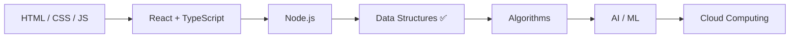

<div align="center">
  

  <a href="https://git.io/typing-svg">
    
  </a>

  <br />

  
  
  
  
</div>

---

<p align="center">
  <b>Frontend developer</b> · 2nd year CSE student at <b>East West University</b><br/>
  Building interfaces with HTML, CSS, JavaScript, and React — while moving into data science, machine learning, and cloud.
</p>

<p align="center">
  <a href="https://github.com/Taskintamim"></a>
  <a href="https://x.com/TaskinTamim4"></a>
  <a href="https://www.facebook.com/taskin.ahme.tamim.1/"></a>
</p>

---

## 👨‍💻 About me

```js
const taskin = {
  role: "Frontend Developer",
  university: "East West University — 2nd year, CSE",
  focus: ["UI engineering", "responsive design", "component-driven React"],
  exploring: ["Data Science", "Machine Learning", "Cloud Computing"],
  next: "Algorithms (just finished Data Structures)",
  shippingSince: 2021,
  publicRepos: 44,
};
```

- 🔭 I design landing pages and web UIs, then implement them in production-style HTML, CSS, and React.
- 🌱 Just finished **Data Structures**. Next: **Algorithms**, plus ongoing study in **AI/ML** and **cloud**.
- 🧠 Comfortable across C, C++, Java, and Python for coursework and problem solving.
- ⚡ I care about clean layout, readable code, and interfaces that feel fast.

---

## 🛠️ Languages and tools

<p align="center">
  
</p>

<p align="center">
  <b>Frontend</b> · HTML · CSS · SCSS · JavaScript · TypeScript · React · Tailwind · Node.js<br/>
  <b>Core CS</b> · C · C++ · Java · Python · Data Structures
</p>

### Editors, design, and workflow

<p align="center">
  
</p>

<p align="center">
  
  
  
  
  
  
  
  
  
  
  
</p>

---

## 🚀 Featured projects

<p align="center">
  <a href="https://github.com/Taskintamim/japanese-foodpage">
    
  </a>
  <a href="https://github.com/Taskintamim/gpt3-tamim">
    
  </a>
</p>
<p align="center">
  <a href="https://github.com/Taskintamim/crypto-site">
    
  </a>
  <a href="https://github.com/Taskintamim/tourist-site">
    
  </a>
</p>
<p align="center">
  <a href="https://github.com/Taskintamim/car-rental">
    
  </a>
  <a href="https://github.com/Taskintamim/weather-app-mobile">
    
  </a>
</p>

| Project | What it is | Stack |
| --- | --- | --- |
| [japanese-foodpage](https://github.com/Taskintamim/japanese-foodpage) | Restaurant landing page with a strong visual identity | HTML, CSS |
| [gpt3-tamim](https://github.com/Taskintamim/gpt3-tamim) | Modern GPT-3 marketing UI | HTML, CSS, JS |
| [crypto-site](https://github.com/Taskintamim/crypto-site) | Crypto product landing page | HTML, CSS |
| [tourist-site](https://github.com/Taskintamim/tourist-site) | Travel / tourism website | HTML, CSS |
| [car-rental](https://github.com/Taskintamim/car-rental) | Car rental service frontend | HTML, CSS |
| [weather-app-mobile](https://github.com/Taskintamim/weather-app-mobile) | Mobile-first weather UI | HTML, CSS |

---

## 🗺️ Current learning path



| Now | Next | Exploring |
| --- | --- | --- |
| Frontend engineering | Algorithms | Data Science, Machine Learning, Cloud |

---

## 📊 GitHub analytics

<div align="center">
  
  
</div>

<div align="center">
  
</div>

<div align="center">
  
</div>

<div align="center">
  
  
</div>

<p align="center">
  
</p>

---

<details open>
<summary><b>💻 Code mode — trophies</b></summary>
<br/>
<p align="center">
  
</p>
</details>

<details>
<summary><b>🕹️ Game mode — contribution snake</b></summary>
<br/>
<p align="center">
  <i>A snake that eats this year’s contribution graph. It updates daily through GitHub Actions.</i>
</p>
<p align="center">
  <picture>
    <source media="(prefers-color-scheme: dark)" srcset="https://raw.githubusercontent.com/Taskintamim/Taskintamim/output/github-contribution-grid-snake-dark.svg" />
    <source media="(prefers-color-scheme: light)" srcset="https://raw.githubusercontent.com/Taskintamim/Taskintamim/output/github-contribution-grid-snake.svg" />
    
  </picture>
</p>
</details>

---

## 🤝 Let’s connect

<p align="center">
  <a href="https://github.com/Taskintamim">GitHub</a> ·
  <a href="https://x.com/TaskinTamim4">X</a> ·
  <a href="https://www.facebook.com/taskin.ahme.tamim.1/">Facebook</a>
</p>

<p align="center">
  <i>Always building. Always learning. Always shipping better UI.</i>
</p>

<div align="center">
  
  
</div>

